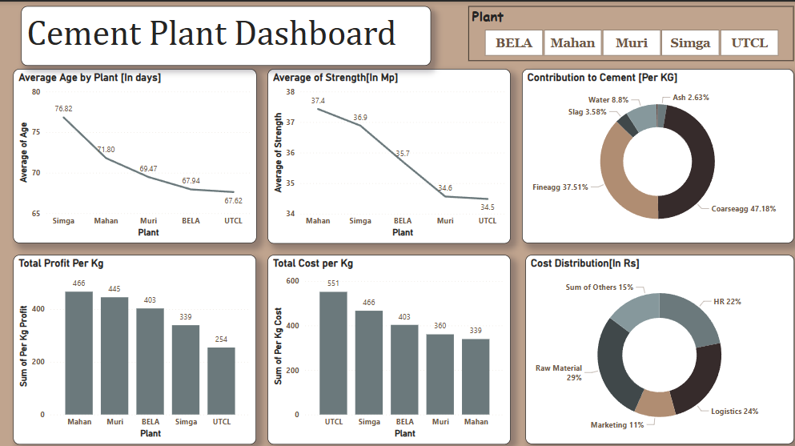

# 🏭 Cement Plant Dashboard: Production & Cost Insights

---

## 🧠 Overview
This project analyses **cement production and costs** across multiple plants (BELA, MAHAN, MURI, SIMGA, UTCL) using Power BI.  
It provides actionable insights into **strength, cost distribution, age, and efficiency**, highlighting best practices and areas for optimization.

---

## 🚀 Project Objective
To create an **interactive dashboard** that transforms raw cement production data into insights on **plant performance, profitability, and cost drivers**.

---

## 📊 Dataset
The dataset tracks cement production with the following columns:  
`Date, Cement, Slag, Ash, Water, Superplastic, Coarseagg, Fineagg, Age (days), Strength (MPa), Per Kg Rate, Per Kg Cost, HR Cost, Logistics Cost, Marketing, Raw Material, Others`.

**Data Cleaning Challenges:**  
1. Inconsistent date ranges — extended all plants to 15th April for fair comparison.  
2. Repeated dates with unique entries — used Power Query to aggregate numerical values and average categorical ones.

---

## 📈 Regression Analysis
- **Objective:** Determine if Age (days) impacts Strength (MPa)  
- **Result:** R² = 0.108 → weak relationship; longer aging does not significantly improve strength, may bottleneck production.

---

## 📊 Dashboard Highlights
- **Average Age:** SIMGA highest (78.2 days), UTCL lowest (67.2 days) → efficiency focus needed.  
- **Average Strength:** MAHAN leads (37.4 MPa), UTCL lags (34.5 MPa) → age not a key factor.  
- **Cement Contribution:** Coarseagg (47.1%) & Fineagg (37.5%) dominate; Water minimal (8.8%).  
- **Total Profit per Kg:** MAHAN ₹466/kg, UTCL ₹254/kg  
- **Total Cost per Kg:** UTCL ₹551/kg, MAHAN ₹343/kg  
- **Cost Distribution:** Raw Material 29%, Logistics 24%, HR 22%

**Takeaways:**  
- MAHAN excels in strength and profitability → study practices  
- UTCL needs optimization → high cost, low strength  
- Long aging (SIMGA) may hinder efficiency without strength gains → focus on faster cycles  

---

## 🛠️ Tools Used
- **Power BI:** Dashboard creation and visualisation  
- **Power Query:** Data cleaning and summarisation  
- **Excel:** Data aggregation  

---

## 💡 Key Learnings
- Handling **inconsistent and complex datasets**  
- Using **Power Query** for summarisation and transformation  
- Converting **raw data into actionable insights** using visual analytics  

---

## 📸 Dashboard Preview

---
